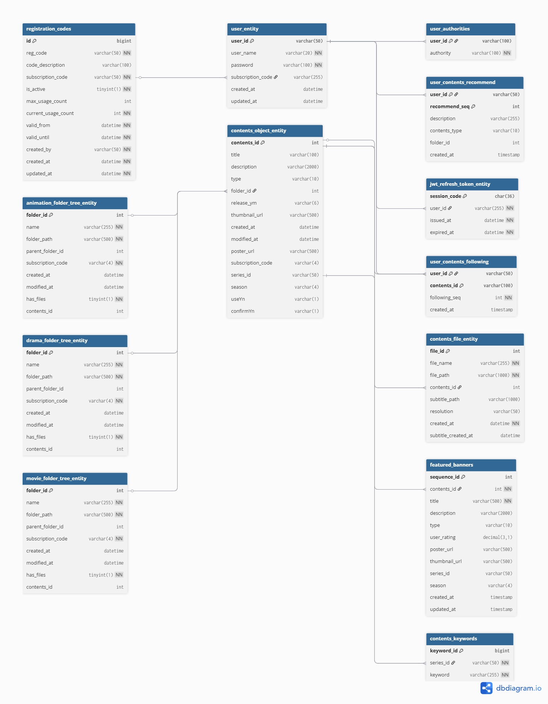

# Webflux 기반 미디어 스트리밍 플랫폼

이 프로젝트는 Spring WebFlux를 사용하여 구축된 고성능 비동기/논블로킹 미디어 스트리밍 및 트랜스코딩 백엔드 서버입니다.
FFmpeg를 활용하여 비디오 메타데이터 관리 및 트랜스코딩을 지원하며,
R2DBC를 통해 데이터베이스와 리액티브하게 통신하며, Elasticsearch를 연동하여 강력한 콘텐츠 검색 기능을 제공합니다.

## 프로젝트 소개

*   **리액티브 비디오 스트리밍**:
    *   HTTP Range 요청을 지원하여 원하는 구간부터 딜레이 없이 비디오를 시청할 수 있습니다.
    *   FFmpeg를 이용하여 HLS 프로토콜을 활용한 트랜스코딩이 가능합니다. (Process 객체의 onExit() 메소드를 통해 생성된 CompletableFuture 객체를 Mono 객체로 변환 수행하여 프로세스를 비동기 구현)
*   **R2DBC 사용**: 리액티브한 비동기 서비스인 Webflux와의 통합을 위하여, 블로킹 방식의 JDBC 대신 논블로킹 방식의 R2DBC를 적용하였습니다.
*   **JWT 기반 인증/인가**: Spring Security와 JWT를 통해 안전한 API 접근 제어를 구현합니다.
*   **Elasticsearch 검색**: 콘텐츠의 메타데이터를 Elasticsearch에 저장하고, 이를 통해 빠르고 정확한 검색 기능을 제공합니다.
*   **Spring Batch 처리**:
    *   파일 시스템의 폴더 구조를 주기적으로 동기화하여 데이터베이스에 반영합니다.
    *   콘텐츠 정보를 업데이트하고 관련 파일 메타데이터를 저장합니다.
*   **파일 시스템 관리**: 서버 내 파일 및 디렉토리 정보를 조회하는 API를 제공합니다.
*   **사용자 관리**: 회원가입 및 로그인 기능을 제공합니다.

### 연관 프로젝트

해당 백엔드 프로젝트와 함께 사용하는 프론트엔드 프로젝트입니다.

*   **프론트엔드**: [React-Streaming](https://github.com/ggbadza/React-Streaming)

## 기술 스택

*   **Backend**: `Java 17`, `Spring Boot 3.x`, `Spring WebFlux`, `Spring Security`, `Spring Batch`
*   **Database**: `R2DBC`, `Mysql`
*   **Search**: `Elasticsearch`
*   **Build Tool**: `Gradle`
*   **Others**: `JWT`, `FFmpeg`

## ERD


## 실행 방법

### 요구 사항

*   `Java 17` 이상
*   `Gradle 8.x` 이상
*   `Docker` 및 `Docker-compose`

### 설치 및 실행

1.  **프로젝트 클론**
    ```bash
    git clone [저장소 URL]
    cd webflux
    ```

2.  **외부 서비스 실행 (Elasticsearch, DB 등)**
    프로젝트 루트의 `docker-compose.yml` 파일을 사용하여 관련 서비스를 실행합니다.
    ```bash
    docker-compose up -d
    ```


## API 명세서

<details>
<summary>응답 객체 상세 정보</summary>

- **UserRegResponse**:
  ```json
  {
    "userId": "string",
    "userName": "string",
    "regCode": "string",
    "msg": "string"
  }
  ```
- **PlayListRecord**:
  ```json
  {
    "videoType": "string",
    "url": "string",
    "pixel": "string",
    "fileId": "long",
    "mimeType": "string"
  }
  ```
- **SubtitleMetadataResponse**:
  ```json
  {
    "hasSubtitle": "string",
    "count": "int",
    "subtitleList": [
      {
        "subtitleId": "string",
        "language": "string"
      }
    ]
  }
  ```
- **ContentsResponse**:
  ```json
  {
    "contentsId": "long",
    "title": "string",
    "description": "string",
    "thumbnailUrl": "string",
    "posterUrl": "string",
    "type": "string",
    "folderId": "long"
  }
  ```
- **RecommendContentsResponse**:
  ```json
  {
    "userId": "string",
    "recommendSeq": "int",
    "description": "string",
    "contentsResponseList": [
      "ContentsResponse"
    ]
  }
  ```
- **FileInfoSummaryResponse**:
  ```json
  {
    "id": "long",
    "fileName": "string",
    "contentsId": "long",
    "hasSubtitle": "boolean",
    "resolution": "string",
    "createdAt": "date-time"
  }
  ```
- **ContentsInfoWithFilesResponse**:
  ```json
  {
    "contentsId": "long",
    "title": "string",
    "description": "string",
    "thumbnailUrl": "string",
    "posterUrl": "string",
    "type": "string",
    "filesInfoList": [
      "FileInfoSummaryResponse"
    ]
  }
  ```
- **ContentsSearchResponse**:
  ```json
  {
    "contentsId": "long",
    "title": "string",
    "description": "string",
    "type": "string",
    "thumbnailUrl": "string",
    "modifiedAt": "date-time"
  }
  ```
- **FeaturedBannersResponse**:
  ```json
  {
    "sequenceId": "long",
    "contentsId": "long",
    "title": "string",
    "description": "string",
    "type": "string",
    "userRating": "number",
    "posterUrl": "string",
    "thumbnailUrl": "string",
    "seriesId": "string",
    "season": "string"
  }
  ```
- **DirectoryRecord**:
  ```json
  {
    "folderId": "long",
    "name": "string",
    "hasFiles": "boolean",
    "contentsId": "long"
  }
  ```
- **VideoFileRecord**:
  ```json
  {
    "pId": "long",
    "fileName": "string",
    "videoPath": "string",
    "subtitlePath": "string",
    "resolution": "string"
  }
  ```
- **배치 API 응답**:
  ```json
  {
    "jobId": "long",
    "status": "string",
    "startTime": "date-time"
  }
  ```

</details>

### 사용자 API

| HTTP Method | URL | 설명 | 요청 본문 (Request Body) | 응답 (Response) |
|---|---|---|---|---|
| POST | `/api/users/register` | 회원가입 | `UserRegRequest` | `UserRegResponse` |
| POST | `/api/users/login` | 로그인 | `LoginRequestRecord` | `boolean` <br/>(JWT 토큰은 쿠키에 담겨 반환) |
| GET, POST | `/api/users/reissue` | 액세스 토큰 재발급 | - | `boolean` <br/>(JWT 토큰은 쿠키에 담겨 반환) |
| GET, POST | `/api/users/me` | 내 정보 조회 | - | `UserRegResponse` |
| GET, POST | `/api/users/logout` | 로그아웃 | - | `boolean` |

### 비디오 API

| HTTP Method | URL | 설명 | 요청 파라미터 (Request Parameters) | 응답 (Response) |
|---|---|---|---|---|
| GET | `/video/test` | API 연결 테스트 | - | `string` |
| GET | `/video/file-range` | 비디오 스트리밍 (Range 요청) | `fileId` (Long) | 비디오 데이터 스트림 |
| GET | `/video/hls.m3u8` | HLS m3u8 플레이리스트 제공 | `fileId` (Long), <br/>`type` (String, optional, default: "0") | `string` (m3u8 플레이리스트) |
| GET | `/video/hls.m3u8.master` | HLS 마스터 플레이리스트 제공 | `fileId` (Long) | `string` (m3u8 마스터 플레이리스트) |
| GET | `/video/playlist` | 커스텀 비디오 플레이리스트 제공| `fileId` (Long) | `List<PlayListRecord>` |
| GET | `/video/hls.ts` | HLS TS 세그먼트 제공 | `fileId` (Long), <br/>`ss` (String), <br/>`to` (String),<br/> `type` (String, optional, default: "0") | TS 데이터 스트림 |
| GET | `/video/subtitle` | 자막 파일 제공 | `fileId` (Long), <br/>`type` (String, optional, default: "f") | 자막 데이터 스트림 |
| GET | `/video/subtitle-metadata` | 자막 메타데이터 제공 | `fileId` (Long) | `SubtitleMetadataResponse` |

### 콘텐츠 API

| HTTP Method | URL | 설명 | 요청 파라미터/본문 | 응답 (Response) |
|---|---|---|---|---|
| GET | `/api/contents/info` | 콘텐츠 상세 정보 조회 | `contentsId` (Long) | `ContentsResponse` |
| POST | `/api/contents/info-recently` | 최근 변경된 콘텐츠 목록 조회 | `type` (String), <br/>`pid` (Long) | `List<ContentsResponse>` |
| GET | `/api/contents/recommend` | 추천 콘텐츠 목록 조회 | - | `List<Recommend`<br/>`ContentsResponse>` |
| GET | `/api/contents/files` | 콘텐츠 파일 목록 조회 | `contentsId` (Long) | `List<FileInfo`<br/>`SummaryResponse>` |
| GET | `/api/contents/contents-info-with-video-files` | 콘텐츠 정보 및 비디오 파일 목록 조회 | `fileId` (Long) | `ContentsInfo`<br/>`WithFilesResponse` |
| POST | `/api/contents/search` | 키워드로 콘텐츠 검색 | `ContentsSearchRequest` | `List<Contents`<br/>`SearchResponse>` |
| GET, POST | `/api/contents/register-following` | 즐겨찾기 추가 | `contentsId` (Long) | `boolean` |
| GET, POST | `/api/contents/delete-following` | 즐겨찾기 삭제 | `contentsId` (Long) | `boolean` |
| GET | `/api/contents/get-following` | 즐겨찾기 목록 조회 | - | `List<Contents`<br/>`Response>` |
| GET, POST | `/api/contents/is-following` | 즐겨찾기 여부 확인 | `contentsId` (Long) | `boolean` |
| GET, POST | `/api/contents/get-featured-banners` | 배너용 콘텐츠 목록 조회 | - | `List<Featured`<br/>`BannersResponse>` |

### 파일 시스템 API

| HTTP Method | URL | 설명 | 요청 파라미터 (Request Parameters) | 응답 (Response) |
|---|---|---|---|---|
| GET | `/api/filesystem/files` | 디렉토리 내 파일/폴더 목록 조회| `type` (String), <br/>`folderId` (Long, optional, default: 1) | `List<DirectoryRecord>` |
| GET | `/api/filesystem/folders` | 디렉토리 내 폴더 목록 조회 | `type` (String), <br/>`folderId` (Long, optional, default: 1) | `List<DirectoryRecord>` |
| POST | `/api/filesystem/video-info` | 비디오 파일 정보 조회 | `type` (String), <br/>`pid` (Long, optional, default: 0), `fn` (String) | `VideoFileRecord` |


## 프로젝트 구조

```
.
├── src
│   ├── main
│   │   ├── java/com/tankmilu
│   │   │   ├── batch       # Spring Batch 관련 설정 및 Tasklet
│   │   │   │   ├── config
│   │   │   │   └── tasklet
│   │   │   └── webflux     # WebFlux 애플리케이션
│   │   │       ├── config
│   │   │       ├── controller
│   │   │       ├── entity
│   │   │       ├── es          # Elasticsearch 관련 Document, Repository
│   │   │       ├── repository
│   │   │       ├── security    # Spring Security 및 JWT 설정
│   │   │       └── service
│   │   └── resources
│   │       ├── application-dev.properties
│   │       └── static
│   └── test
└── build.gradle
```
